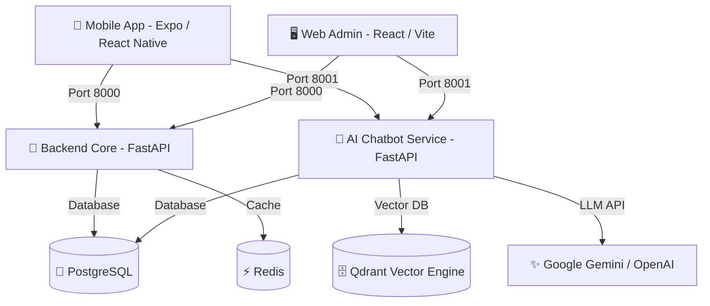
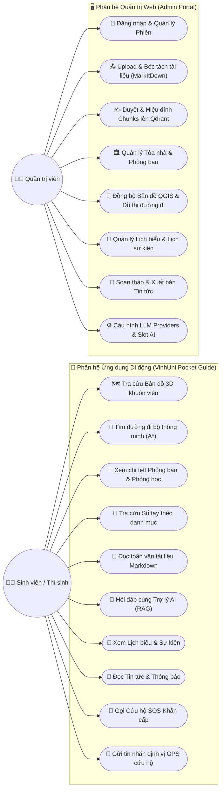

# 🎓 VINHUNI POCKET GUIDE — SỔ TAY SINH VIÊN ĐẠI HỌC VINH

Hệ sinh thái số hóa toàn diện dành cho sinh viên và ban giám hiệu Trường Đại học Vinh, bao gồm: **Ứng dụng di động Đa nền tảng (React Native / Expo)**, **Hệ thống Quản trị Web Admin (React / Vite / Ant Design)**, **Hệ thống Trợ lý ảo AI Chatbot RAG (FastAPI / Qdrant / Gemini)** và **Bản đồ số hóa khuôn viên 3D (MapLibre / A* Pathfinding Engine)**.

---

## 📑 MỤC LỤC
1. [Kiến trúc Tổng thể Hệ thống](#-kiến-trúc-tổng-thể-hệ-thống)
2. [Yêu cầu Cài đặt Môi trường](#-yêu-cầu-cài-đặt-môi-trường)
3. [Hướng dẫn Khởi động Dự án (1-Click & Thủ công)](#-hướng-dẫn-khởi-động-dự-án)
4. [Hướng dẫn Chức năng Bản đồ 3D & Đồng bộ Dữ liệu QGIS](#-hướng-dẫn-bản-đồ-3d--đồng-bộ-dữ-liệu-qgis)
5. [Phân hệ Quản trị Web Admin (Port 5173)](#-phân-hệ-quản-trị-web-admin)
6. [Phân hệ Ứng dụng Di động (Mobile App)](#-phân-hệ-ứng-dụng-di-động-mobile-app)
7. [Tài liệu API Endpoints (Backend & AI Microservice)](#-tài-liệu-api-endpoints)

---

## 🏛️ KIẾN TRÚC TỔNG THỂ HỆ THỐNG

Dự án được xây dựng theo kiến trúc Microservices phân tách độc lập:



### Các thành phần chính:
- **`backend/` (Port 8000):** FastAPI xử lý nghiệp vụ Quản trị, Xác thực (Auth), Bản đồ A* Routing, Phòng ban, Lịch biểu, Tin tức, SOS và CRUD Tài liệu.
- **`api-chatbot/` (Port 8001):** Microservice AI xử lý ETL Ingestion (`MarkItDown`), Embeddings (`bge-m3`), Vector Database (`Qdrant`) và LLM Agent RAG (`Gemini / Multi-slot`).
- **`frontend/` (Port 5173):** Trang quản trị Web Admin dành cho cán bộ/quản trị viên (React, Vite, Ant Design).
- **`VinhUni-Pocket-Guide/`:** Ứng dụng di động cho sinh viên (Expo SDK, React Native, MapLibre GL, React Native Markdown).

---

## 👥 SƠ ĐỒ USE CASE HỆ THỐNG (USE CASE DIAGRAM)

Hệ thống phục vụ 2 nhóm tác nhân (Actors) chính: **Sinh viên / Thí sinh (Mobile App)** và **Quản trị viên / Cán bộ nhà trường (Web Admin)**:



---

## ⚙️ YÊU CẦU CÀI ĐẶT MÔI TRƯỜNG

Trước khi bắt đầu, hãy đảm bảo máy tính đã cài đặt các công cụ sau:
1. **Docker Desktop** (Bật tính năng WSL 2 Backend trên Windows).
2. **Node.js** phiên bản `>= 20.x` và **npm** / **yarn**.
3. **Python** phiên bản `>= 3.10` (nếu muốn chạy trực tiếp không qua Docker).
4. **Android Studio** (Kèm theo **Android SDK**, **Android SDK Platform-Tools** và ít nhất một máy ảo **Android Emulator**).

---

## 🚀 HƯỚNG DẪN KHỞI ĐỘNG DỰ ÁN

### ⚡ Cách 1: Khởi động 1-Click Tự Động (Khuyến nghị trên Windows)

Trong thư mục gốc của dự án `d:\so-tay-sinh-vien`:
- **Chỉ cần nhấp đúp chuột (Double-click)** vào tệp **`start_all.bat`** (hoặc chạy lệnh `powershell -ExecutionPolicy Bypass -File .\start_all.ps1`).

**Script sẽ tự động:**
1. Khởi động toàn bộ Container Docker (Postgres, Redis, Qdrant, Backend 8000, AI Chatbot 8001, Frontend 5173).
2. Tự động kiểm tra và khởi chạy **Android Studio**.
3. Mở cửa sổ riêng biệt để chạy ứng dụng **Expo Mobile**.
4. In **Bảng điều khiển trạng thái (Dashboard CLI)** với đầy đủ liên kết truy cập lên màn hình.

---

### 🛠️ Cách 2: Khởi động Thủ công từng phần

#### Bước 1: Khởi động các dịch vụ Docker
```bash
docker compose up -d --build
```

#### Bước 2: Chạy Web Admin (nếu không chạy qua Docker)
```bash
cd frontend
npm install
npm run dev
# Truy cập: http://localhost:5173
```

#### Bước 3: Chạy Ứng dụng Di động
```bash
cd VinhUni-Pocket-Guide
npm install
# Mở máy ảo Android trên Android Studio trước, sau đó chạy:
npx expo run:android
```

---

## 🗺️ HƯỚNG DẪN BẢN ĐỒ 3D & ĐỒNG BỘ DỮ LIỆU QGIS

Hệ thống sử dụng bản đồ vector 3D (3D Building Extrusion) kết hợp mạng lưới đồ thị tìm đường đi bộ trong khuôn viên Trường Đại học Vinh.

### 1. Cấu trúc tệp dữ liệu không gian (GeoJSON):
Toàn bộ dữ liệu bản đồ được lưu tại thư mục: **`backend/static/data/`**
- **`vinhuni_buildings.geojson`:** Chứa Polygon của các tòa nhà. Thuộc tính quan trọng:
  - `height`: Chiều cao tòa nhà (mét) để render khối 3D trên mobile.
  - `name`: Tên tòa nhà (ví dụ: Nhà A1, Nhà A2, KTX...).
  - `code`: Mã tòa nhà.
- **`vinhuni_paths.geojson`:** Chứa mạng lưới LineString biểu diễn các tuyến đường đi bộ nội khu.
- **`vinhuni_walkable_areas.geojson`:** Chứa các vùng sân trường, vỉa hè cho phép đi bộ tự do.

### 2. Quy trình chỉnh sửa trên QGIS và Đồng bộ:
1. Mở phần mềm **QGIS**, chỉnh sửa hoặc vẽ thêm tòa nhà / đường đi mới.
2. Xuất dữ liệu dưới định dạng **GeoJSON (Hệ tọa độ EPSG:4326 - WGS 84)**.
3. Sao chép và ghi đè các file vào thư mục:
   ```
   d:\so-tay-sinh-vien\backend\static\data\
   ```
4. **Kích hoạt nạp lại đồ thị tìm đường:**
   - Cách 1: Bấm nút **"Đồng bộ bản đồ"** trên trang Quản trị Tòa nhà & Bản đồ.
   - Cách 2: Gọi API `POST http://localhost:8000/api/admin/map/sync-cache`.
   - Thuật toán **A* Pathfinding Engine** trong `backend/core/map_engine.py` sẽ tự động dựng lại mạng lưới đồ thị (Graph Network) và cung cấp đường đi ngay lập tức cho điện thoại.

---

## 🖥️ PHÂN HỆ QUẢN TRỊ WEB ADMIN

Truy cập: **`http://localhost:5173`** *(Tài khoản mặc định: `admin` / `admin`)*

### 1. Quản lý & Duyệt Tài liệu Tuyển sinh (RAG Ingestion)
- **Tải lên:** Kéo thả tệp `.pdf`, `.docx`, `.txt`, chọn năm phát hành và loại tài liệu (*Đề án, Quy chế, Điểm chuẩn, Học phí, Đời sống SV...*).
- **Trích xuất toàn văn:** Công cụ `MarkItDown` tự động bóc tách toàn bộ nội dung Markdown và lưu vào trường `full_content` trong PostgreSQL.
- **Duyệt Chunks (Bắt buộc):** Chuyển sang màn hình `Duyệt Chunks` để chỉnh sửa, tinh giản các đoạn văn bản trước khi bấm **Lưu & Duyệt Chunks** để tạo Vector Embeddings (`bge-m3`) đẩy lên **Qdrant**.

### 2. Quản lý Tòa nhà & Phòng ban
- **Quản lý Tòa nhà:** Thêm, Sửa, Xóa thông tin tòa nhà, mã code, tọa độ GPS, số tầng và chiều cao 3D.
- **Quản lý Phòng ban:** Quản lý danh sách đơn vị, gắn vào tòa nhà trực thuộc, mô tả chi tiết phòng học / chức năng nhiệm vụ (cột *Mô tả*).

### 3. Quản lý Lịch biểu & Sự kiện
- Lập lịch sự kiện trường, lễ khai giảng, hạn nộp học phí, ngày thi. Hỗ trợ trường thông tin *Mô tả chi tiết*, ngày bắt đầu/kết thúc và địa điểm tổ chức.

### 4. Quản lý Tin tức & Thông báo
- Trình soạn thảo văn bản phong phú (Rich-text Editor), upload ảnh bìa (Cloudinary), xuất bản tin tức tức thì tới toàn bộ sinh viên.

### 5. Cấu hình Trợ lý AI (Multi-Slot Router)
- Quản lý linh hoạt nhiều nhà cung cấp AI: **Google Gemini, OpenAI, Groq, Ollama**.
- Phân luồng Slot thông minh: Slot 1 (General Chat), Slot 2 (RAG Tra cứu sâu), Slot 3 (Router Intent).

---

## 📱 PHÂN HỆ ỨNG DỤNG DI ĐỘNG (MOBILE APP)

Ứng dụng `VinhUni-Pocket-Guide` được tối ưu hóa giao diện Native mượt mà:

### 1. Trang chủ (Home)
- **Truy cập nhanh 1 chạm:** Banner mở Bản đồ 3D, Lịch biểu, Tin tức, Sổ tay sinh viên.
- **🚨 Nút SOS Cứu hộ Khẩn cấp:**
  - Chạm 1 phát mở ngay Modal BottomSheet cứu hộ.
  - Gọi nhanh đường dây nóng: Bảo vệ trường (`0238.3855.452`), Trạm y tế (`0238.3855.451`), 113, 114, 115.
  - Nút **"Gửi vị trí GPS hiện tại"**: Tự động lấy tọa độ thực tế tạo link Google Maps gửi qua tin nhắn SMS cho bảo vệ / người thân.

### 2. Bản đồ Số hóa 3D (Interactive Campus Map)
- Render khối nhà 3D chân thực, hiển thị Marker địa điểm / phòng ban.
- Tìm đường đi bộ thông minh giữa 2 điểm bất kỳ trong trường theo thuật toán A*.
- BottomSheet hiển thị thông tin phòng ban, phòng học, mô tả chi tiết và nút "Chỉ đường đến đây".

### 3. Sổ Tay Sinh Viên Số Hóa (Handbook)
- Thanh trượt Tab danh mục ngang tương ứng từng loại tài liệu (*Đề án, Quy chế, Điểm chuẩn, Học phí, Đời sống SV...*).
- **Trình đọc Toàn văn chuẩn Markdown (`handbook/[id]`):** Kết xuất sắc nét tiêu đề H1-H4, in đậm, in nghiêng, trích dẫn, bảng biểu (Tables) và danh sách.

### 4. Lịch Biểu Sinh Viên (Calendar)
- Danh sách sự kiện trực quan, phân loại theo ngày tháng, xem chi tiết mô tả sự kiện.

### 5. Tin tức & Sự kiện (News)
- Thẻ tin tức thiết kế chuẩn 170px, hỗ trợ phân tích HTML sang Markdown khi đọc bài viết chi tiết.

### 6. Trợ lý AI Chatbot
- Trò chuyện thông minh, trả lời câu hỏi dựa trên kho tri thức tuyển sinh và quy chế của trường được trích xuất từ Qdrant Vector Engine.

---

## 🌐 TÀI LIỆU CHI TIẾT LUỒNG HOẠT ĐỘNG CỦA CÁC API ENDPOINTS

Hệ thống cung cấp hệ sinh thái RESTful API phân chia theo 2 Microservices độc lập:

```
┌────────────────────────────────────────────────────────┐
│  1. BACKEND CORE (Cổng 8000) - Nghiệp vụ & Dữ liệu     │
│  2. AI CHATBOT (Cổng 8001)   - ETL RAG & LLM Inference │
└────────────────────────────────────────────────────────┘
```

---

### A. PHÂN HỆ TÀI LIỆU & RAG PIPELINE

#### 1. `POST http://localhost:8001/api/documents/upload` (Upload & Xử lý File)
- **Mục đích:** Tiếp nhận tệp tài liệu PDF/DOCX/TXT và kích hoạt quy trình bóc tách nội dung tự động.
- **Luồng hoạt động từng bước:**
  1. Nhận tệp qua Multipart Form (`file`, `year`, `doc_type`, `custom_filename`).
  2. Xác thực định dạng tệp hợp lệ (`.pdf`, `.docx`, `.txt`) và ghi file vật lý vào `data/uploads/`.
  3. Khởi tạo bản ghi trong bảng `uploaded_documents` của PostgreSQL với trạng thái ban đầu `status = "processing"`.
  4. Đẩy tác vụ chạy ngầm (**Background Task**) vào hàm `process_document`:
     - **Layer 1 (Converter):** Dùng `MarkItDown` trích xuất toàn bộ văn bản sang chuỗi **Markdown nguyên bản** và lưu trực tiếp vào trường `full_content` của bảng `uploaded_documents` (phục vụ Sổ tay Mobile).
     - **Layer 2 (Chunking):** Chuẩn hóa tiêu đề (`normalize_fake_headings`), phân tách văn bản thành các đoạn có cấu trúc bằng `MarkdownHeaderTextSplitter` và `RecursiveCharacterTextSplitter` (kích thước 1000 ký tự, gối đầu 150 ký tự).
     - **Layer 3 (Context Injection):** Gắn tiêu đề ngữ cảnh `[Tài liệu: ... | Năm: ... | Danh mục: ... | Mục: ...]` vào đầu mỗi đoạn chunk.
     - Lưu toàn bộ các đoạn cắt vào bảng `document_chunks` với trạng thái `status = "pending"`.
     - Cập nhật trạng thái tài liệu sang `status = "pending_review"` (Chờ duyệt chunks).
  5. Trả về mã phản hồi `200 OK` kèm `document_id`.

#### 2. `GET http://localhost:8001/api/documents/{doc_id}/chunks` (Lấy Chunks Chờ Duyệt)
- **Mục đích:** Cung cấp danh sách các đoạn văn bản vừa cắt để Quản trị viên kiểm tra trên Web Admin (`ChunkReview.jsx`).
- **Luồng hoạt động:**
  1. Kiểm tra sự tồn tại của `doc_id` trong cơ sở dữ liệu.
  2. Truy vấn bảng `document_chunks` lấy toàn bộ các đoạn có `status = 'pending'` theo thứ tự xuất hiện ban đầu.
  3. Trả về mảng JSON chứa `id`, `content`, `metadata_payload`.

#### 3. `POST http://localhost:8001/api/documents/{doc_id}/approve-chunks` (Duyệt & Vectorize lên Qdrant)
- **Mục đích:** Xác nhận nội dung các đoạn văn bản, tạo Vector Embeddings và nạp vào Qdrant Vector DB để Chatbot AI sử dụng.
- **Luồng hoạt động:**
  1. Nhận danh sách chunks đã được admin kiểm duyệt và chỉnh sửa (`chunk_id`, `content`).
  2. Cập nhật nội dung mới vào `document_chunks` và đánh dấu `status = 'approved'`.
  3. Chuyển trạng thái tài liệu sang `status = 'embedding'`.
  4. Chạy mô hình Embedding `BAAI/bge-m3` để sinh vector biểu diễn:
     - **Dense Vector:** 1024 chiều biểu diễn ngữ nghĩa sâu.
     - **Sparse Vector:** Từ khóa trọng số (BM25 / Sparse Index).
  5. Đóng gói Point Struct với `id = db_chunk.id` và Payload Metadata `{ "document_id": doc_id, "chunk_id": chunk_id, "content": ... }`.
  6. Đẩy (`upsert_points`) toàn bộ vector vào Collection `tuyen_sinh_dhv` trong Qdrant.
  7. Cập nhật `UploadedDocument.status = "success"` (Hoàn thành - chính thức phát hành cho AI và Sổ tay Mobile).

#### 4. `DELETE http://localhost:8001/api/documents/{doc_id}` (Xóa Toàn Diện Tài Liệu)
- **Mục đích:** Xóa tài liệu khỏi hệ thống một cách triệt để và an toàn.
- **Luồng hoạt động:**
  1. Tìm bản ghi trong PostgreSQL, xóa file vật lý trong `data/uploads/`.
  2. Gọi `delete_points_by_document_id(doc_id)` quét và xóa sạch toàn bộ Vector Points trong Qdrant có `payload.document_id == doc_id`.
  3. Xóa bản ghi `UploadedDocument` trong PostgreSQL (tự động Cascade xóa sạch các bản ghi con trong `document_chunks`).

#### 5. `GET http://localhost:8000/api/admin/documents` (Tra cứu Sổ tay & Quản lý)
- **Mục đích:** Phục vụ ứng dụng Sổ tay Mobile và Bảng quản trị danh sách tài liệu.
- **Luồng hoạt động:**
  1. Hỗ trợ 2 tham số truy vấn: `doc_type` (lọc theo danh mục: `de_an`, `quy_che`, `diem_chuan`...) và `status` (lọc trạng thái).
  2. Ứng dụng di động truyền `status=success` để **chỉ lấy các tài liệu đã được duyệt hoàn tất**.
  3. Trả về danh sách tài liệu kèm ngày tạo, năm phát hành và trạng thái.

#### 6. `GET http://localhost:8000/api/admin/documents/{doc_id}` (Đọc Toàn Văn Markdown)
- **Mục đích:** Cung cấp chuỗi Markdown `full_content` cho màn hình Đọc tài liệu trên điện thoại (`src/app/handbook/[id].tsx`).
- **Luồng hoạt động:**
  1. Truy vấn `UploadedDocument` theo `doc_id`.
  2. Trả về toàn bộ thuộc tính kèm văn bản toàn văn `full_content`. Ứng dụng di động dùng thư viện `react-native-markdown-display` để render định dạng bảng, tiêu đề, in đậm.

---

### B. PHÂN HỆ BẢN ĐỒ & TÌM ĐƯỜNG ĐI BỘ (A* PATHFINDING)

#### 1. `POST http://localhost:8000/api/admin/map/route` (Tính Toán Tuyến Đường Ngắn Nhất)
- **Mục đích:** Tìm đường đi bộ tối ưu giữa 2 vị trí bất kỳ trong khuôn viên trường.
- **Luồng hoạt động:**
  1. Nhận JSON đầu vào: `{ start_lat, start_lng, end_lat, end_lng }`.
  2. Thuật toán `MapEngine` tìm 2 nút giao (Nodes) gần nhất trên đồ thị đường đi (`vinhuni_paths.geojson` & `vinhuni_walkable_areas.geojson`).
  3. Sử dụng giải thuật **A* (A-Star)** với hàm Heuristic khoảng cách Haversine trên quả địa cầu để tìm đường đi ngắn nhất.
  4. Nối điểm xuất phát thực tế $\rightarrow$ Điểm đầu đồ thị $\rightarrow$ Dọc mạng lưới đường đi $\rightarrow$ Điểm cuối đồ thị $\rightarrow$ Điểm đích thực tế.
  5. Trả về GeoJSON LineString kèm thông số tổng chiều dài (mét) và thời gian đi bộ ước tính (phút).

#### 2. `POST http://localhost:8000/api/admin/map/sync-cache` (Đồng Bộ & Dựng Lại Đồ Thị)
- **Mục đích:** Tải lại dữ liệu bản đồ khi Quản trị viên cập nhật file GeoJSON từ QGIS.
- **Luồng hoạt động:**
  1. Đọc lại 3 tệp `vinhuni_paths.geojson`, `vinhuni_walkable_areas.geojson`, `vinhuni_buildings.geojson` trong thư mục `backend/static/data/`.
  2. Tái tạo mạng lưới Đồ thị NetworkX trong bộ nhớ RAM của Backend.
  3. Trả về thông báo thành công và số lượng Node/Edge đã nạp.

#### 3. `GET http://localhost:8000/api/admin/departments` & `GET /map/departments`
- **Mục đích:** Cung cấp vị trí Marker và mô tả chi tiết phòng ban / phòng học cho bản đồ.
- **Luồng hoạt động:**
  1. Truy vấn bảng `departments` kèm quan hệ `building` (`selectinload`).
  2. Tự động gán tọa độ của Tòa nhà nếu phòng ban không có tọa độ riêng.
  3. Cung cấp dữ liệu cột `function_description` (Mô tả phòng học/nhiệm vụ) lên màn hình chi tiết của Mobile Map.

---

### C. PHÂN HỆ TRỢ LÝ AI CHATBOT (RAG AGENT)

#### 1. `POST http://localhost:8001/api/chat` (Hỏi Đáp Thông Minh Đa Luồng)
- **Mục đích:** Xử lý hội thoại của sinh viên và trích xuất tri thức tuyển sinh chính xác.
- **Luồng hoạt động:**
  1. Nhận `message` và `session_id` từ người dùng.
  2. Kiểm tra và tải lịch sử hội thoại gần nhất từ bộ nhớ tạm **Redis** (`SESSION_TTL_SECONDS = 1800`).
  3. Đưa câu hỏi qua bộ Vectorizer `bge-m3` để tạo Dense & Sparse Vector.
  4. Thực hiện **Hybrid Search (Tìm kiếm Lai)** trên Collection Qdrant:
     - Tính điểm tương đồng ngữ nghĩa (Cosine Similarity).
     - Kết hợp so khớp từ khóa chính xác (Sparse Match).
     - Trích xuất Top 5 Chunks phù hợp nhất và lọc ngưỡng tin cậy.
  5. Ghép các Chunks tìm được vào **System Prompt**:
     - Quy định AI chỉ trả lời dựa trên thông tin thực tế từ tài liệu trường.
     - Trích dẫn rõ nguồn tài liệu và năm phát hành.
  6. Gửi Prompt đến Model LLM đang kích hoạt (Google Gemini 2.5 Flash / OpenAI GPT / Groq) để sinh câu trả lời.
  7. Lưu câu hỏi và câu trả lời vào Redis để duy trì ngữ cảnh cho các lượt chat tiếp theo.

---

### D. PHÂN HỆ QUẢN TRỊ NỘI DUNG (LỊCH BIỂU, TIN TỨC, CỨU HỘ SOS)

#### 1. `GET & POST http://localhost:8000/api/admin/calendar` (Lịch & Sự Kiện)
- Lưu trữ và cung cấp lịch thi, lịch nghỉ lễ, thời hạn nộp học phí. Hỗ trợ trường thông tin `description` (Mô tả chi tiết), ngày bắt đầu/kết thúc và địa điểm.

#### 2. `GET & POST http://localhost:8000/api/admin/news` (Tin Tức Sinh Viên)
- Lưu trữ bài viết dạng Rich-text HTML (từ trình soạn thảo Quill), ảnh bìa đại diện và danh mục tin tức. Khi Mobile hiển thị sẽ tự động chuyển đổi sang Markdown thân thiện.

#### 3. `GET http://localhost:8000/api/admin/emergency/templates` (Mẫu Tin Nhắn SOS)
- Cung cấp danh sách mẫu tin nhắn cứu hộ khẩn cấp (*Y tế, An ninh, Cháy nổ, Trộm cắp*) kèm cơ chế tự động đính kèm liên kết tọa độ vị trí Google Maps của sinh viên.

---

**© 2026 Trường Đại học Vinh — VinhUni Pocket Guide System.**

